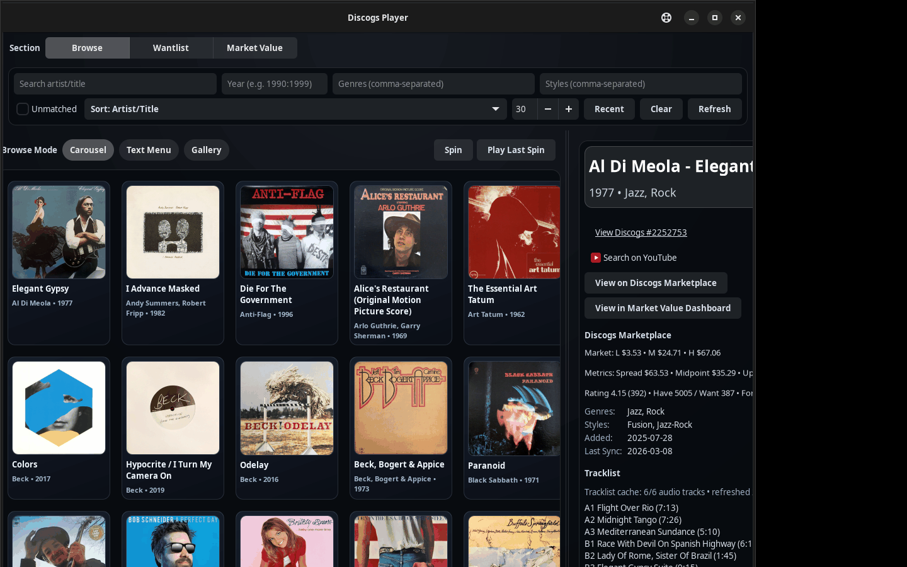
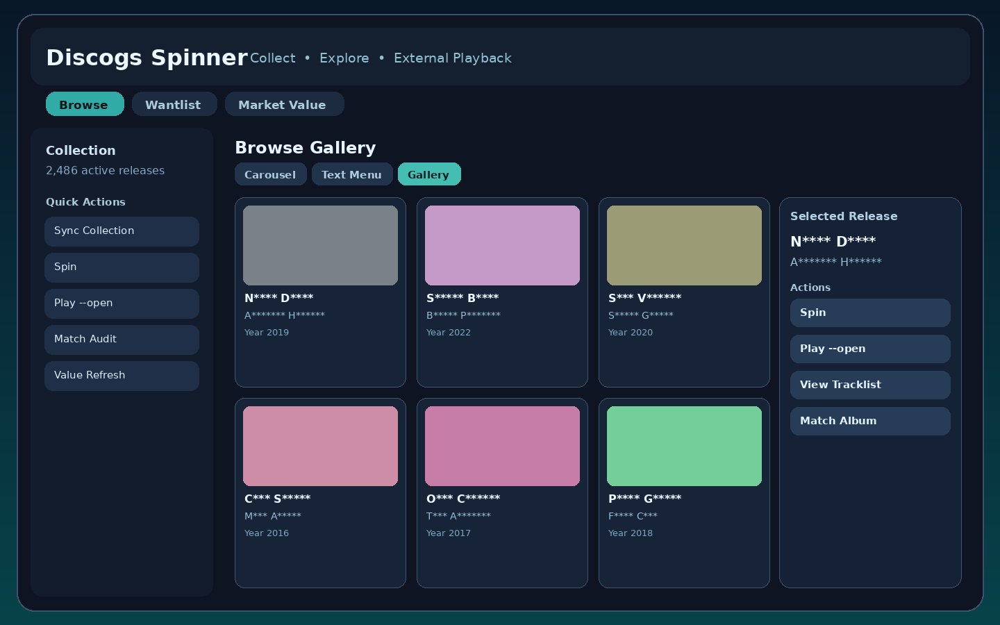
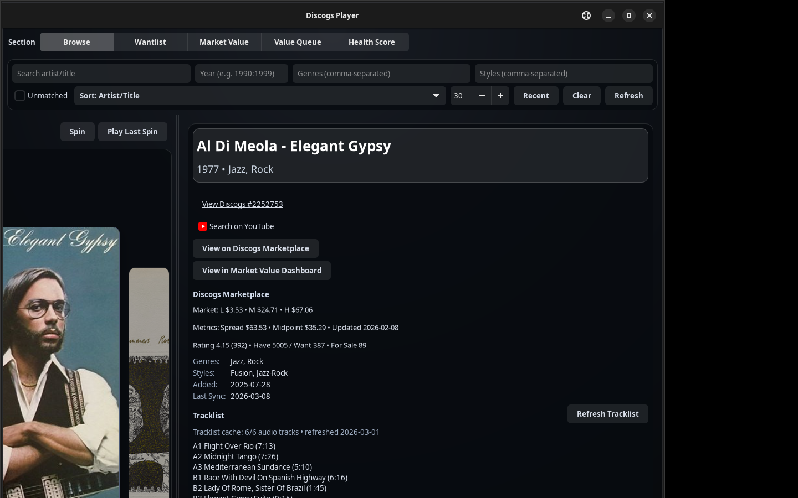
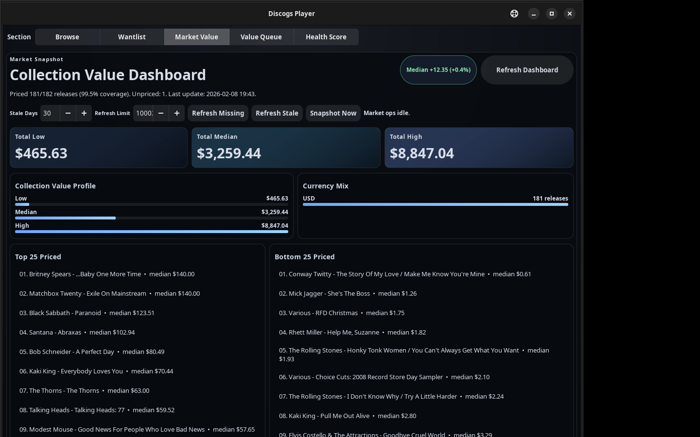
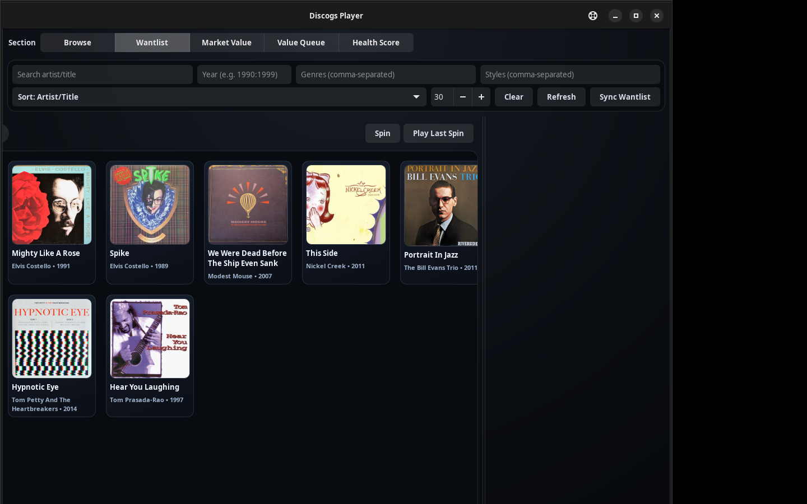
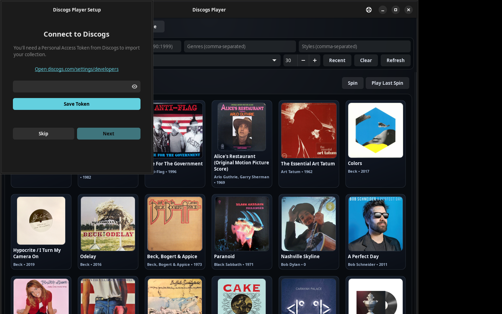

# Discogs Spinner

> Your vinyl collection, supercharged.

<p align="center">
  <a href="https://github.com/edonahue/Discogs_Spinner/actions/workflows/core_plus_ci.yml"></a>
  <a href="https://github.com/edonahue/Discogs_Spinner/actions/workflows/installer_build.yml"></a>
  <a href="https://github.com/edonahue/Discogs_Spinner/releases/latest"></a>
  
  <a href="LICENSE"></a>
  
</p>

<p align="center">
  
</p>

Native Discogs collector app for vinyl fans who want to stop juggling browser tabs. Install on Linux, Windows, or macOS, sync your collection with a personal token, spin a random pick, and see value, wantlist, and playback context in one place.

> **Playback note:** Discogs Spinner does not stream audio. It controls playback in external apps (e.g. Spotify Connect).

---

## Why Discogs Spinner?

Your Discogs collection probably lives in a browser tab today. You scroll it when you cannot decide
what to spin, check market prices in another tab, and bounce into Spotify when you finally make a
decision. Discogs Spinner turns that into one focused desktop experience: your collection, random
picks, wantlist context, and market value in one local app. No subscription. No extra cloud
account. Just your collection on your machine.

---

## What You Get

- **Browse & Spin** — gallery, carousel, or text-menu view with a one-click random pick
- **Market Value Tracking** — price history, snapshot diffs, value movers, a refresh priority queue (`dplayer value queue`), and a market value dashboard
- **Collection Health** — scored summary of mapping coverage and staleness (`dplayer health`)
- **Wantlist Management** — priority signals, opportunity comparisons, and filtered views
- **Playback Control** *(optional)* — Spotify Connect or YouTube Music (open-in-browser)
- **Setup Wizard** — first-run token configuration, no terminal required
- **CLI-first & SSH-ready** — every workflow available from `dplayer` in a terminal

---

## Three Ways to Use

| Mode | Launch | Best for |
|------|--------|----------|
| **Native app** | Installed desktop app | Windows, macOS, Linux desktop users |
| **CLI** | `dplayer` | Terminal users, SSH, scripting |
| **Web App** | `dplayer-api` then open browser | Browser-first setups on any OS |

---

## Screenshots

<p align="center">
  
  
</p>
<p align="center"><em>Browse gallery &nbsp;·&nbsp; Album detail after spin</em></p>

<p align="center">
  
  
</p>
<p align="center"><em>Collection Value Dashboard &nbsp;·&nbsp; Wantlist gallery</em></p>

<p align="center">
  
</p>
<p align="center"><em>Setup Wizard — first-run token configuration</em></p>

---

## Download Now

- [Open the latest stable release page](https://github.com/edonahue/Discogs_Spinner/releases/latest)
- Windows: use the guided installer first: [Discogs Spinner_0.2.0_x64-setup.exe](https://github.com/edonahue/Discogs_Spinner/releases/download/v0.2.0/Discogs.Spinner_0.2.0_x64-setup.exe). Use [Discogs Spinner_0.2.0_x64_en-US.msi](https://github.com/edonahue/Discogs_Spinner/releases/download/v0.2.0/Discogs.Spinner_0.2.0_x64_en-US.msi) only if you specifically want MSI deployment tooling.
- macOS: download the `.dmg` that matches your Mac, then drag **Discogs Spinner** into `/Applications`: [Apple Silicon](https://github.com/edonahue/Discogs_Spinner/releases/download/v0.2.0/Discogs.Spinner_0.2.0_aarch64.dmg) or [Intel](https://github.com/edonahue/Discogs_Spinner/releases/download/v0.2.0/Discogs.Spinner_0.2.0_x64.dmg).
- Debian/Ubuntu: start with the GTK desktop build: [discogs-spinner-gtk4_0.2.0_amd64.deb](https://github.com/edonahue/Discogs_Spinner/releases/download/v0.2.0/discogs-spinner-gtk4_0.2.0_amd64.deb).
- Linux portable fallback: [Discogs Spinner_0.2.0_amd64.AppImage](https://github.com/edonahue/Discogs_Spinner/releases/download/v0.2.0/Discogs.Spinner_0.2.0_amd64.AppImage).
- Linux alternate desktop build: [discogs-spinner-tauri_0.2.0_amd64.deb](https://github.com/edonahue/Discogs_Spinner/releases/download/v0.2.0/discogs-spinner-tauri_0.2.0_amd64.deb).
- Verify downloads with [CHECKSUMS-INSTALLERS.txt](https://github.com/edonahue/Discogs_Spinner/releases/download/v0.2.0/CHECKSUMS-INSTALLERS.txt).

What first launch should feel like:

- The app opens into a simple setup wizard if no Discogs token is configured yet.
- You paste your token once, start your first sync, and wait for the collection view to load.
- A good first run ends with your collection visible in the app, not a blank screen or a terminal prompt.

Quick install notes:

- Windows may show a SmartScreen warning until code signing is added.
- macOS builds are currently unsigned and may require a one-time Gatekeeper approval step.
- Debian/Ubuntu users should start with the GTK `.deb`; the Tauri `.deb` is an alternate desktop build, and the AppImage is the portable fallback.

Sending this to a friend?

- Use the [Friend Trial Guide](docs/friend_trial.md) for the shortest install/setup checklist.
- Ask them to report install, setup, or playback friction with OS, installer used, exact warning text, and a screenshot if possible.
- GitHub issue templates: [install](https://github.com/edonahue/Discogs_Spinner/issues/new?template=install_failure.yml), [auth/setup](https://github.com/edonahue/Discogs_Spinner/issues/new?template=auth_failure.yml), [playback](https://github.com/edonahue/Discogs_Spinner/issues/new?template=playback_failure.yml)

Need the terminal-first path instead?

```bash
python3 -m venv .venv
source .venv/bin/activate
pip install -e .

export DISCOGS_TOKEN="your_discogs_personal_token"

dplayer setup
dplayer sync
dplayer spin
dplayer play --open
```

Need a token? [Get your Discogs personal access token →](docs/token_setup.md)

Optional Spotify addon:

```bash
pip install -e ".[spotify]"
dplayer auth spotify-doctor
```

Need Spotify credentials? [Set up Spotify API access →](docs/token_setup.md#spotify-api-credentials)

---

## OS Quickstarts

> **New here?**
> - Easiest native install: [Windows Quickstart](docs/quickstart_windows.md), [macOS Quickstart](docs/quickstart_macos.md), or [Debian Quickstart](docs/quickstart_debian.md)
> - No-install browser fallback: [Web App Quickstart](docs/quickstart_web.md) (Windows / macOS / Linux)
> - Linux desktop: [Debian Quickstart](docs/quickstart_debian.md)
> - Windows native installer: [Windows Quickstart](docs/quickstart_windows.md)
> - macOS native installer: [macOS Quickstart](docs/quickstart_macos.md)

- [Not sure where to start? → START HERE](docs/START_HERE.md)
- [Windows Quickstart](docs/quickstart_windows.md)
- [Windows + WSL2 GUI Quickstart](docs/quickstart_wsl2.md)
- [Debian Quickstart](docs/quickstart_debian.md)
- [macOS Quickstart](docs/quickstart_macos.md)
- [Web App Quickstart](docs/quickstart_web.md)
- [Token Setup (Discogs + Spotify)](docs/token_setup.md)
- [Friend Trial Guide](docs/friend_trial.md)

---

## Docs

Technical references:

- [Web App README](webapp/README.md)
- [Desktop Shell README](desktop_shell/README.md)
- [Support Matrix](docs/SUPPORT_MATRIX.md)
- [1.0 Release Target](docs/RELEASE_TARGET_v1.0.md)
- [1.0 Readiness Tracker](docs/V1_READINESS_TRACKER.md)
- [Code Signing Guide](docs/SIGNING.md)
- [Architecture ADRs](docs/adr/001-layered-architecture.md)

<details>
<summary>Project & release docs</summary>

- [Product State](PRODUCT_STATE.md)
- [Cross-Platform Implementation Roadmap](docs/CROSS_PLATFORM_IMPLEMENTATION_ROADMAP.md)
- [Stabilization Execution Tracker](docs/STABILIZATION_EXECUTION_2026Q1.md)
- [Public Release Runbook](docs/PUBLIC_RELEASE_RUNBOOK.md)
- [Release Notes (v0.2.0)](docs/releases/v0.2.0.md)

</details>

---

## Contributing & Legal

- [Contributing](CONTRIBUTING.md)
- [Report a bug or request a feature](https://github.com/edonahue/Discogs_Spinner/issues)
- [LICENSE](LICENSE)
- [PRIVACY.md](PRIVACY.md)
- [TERMS.md](TERMS.md)
- [TRADEMARKS.md](TRADEMARKS.md)
- [COMPLIANCE.md](COMPLIANCE.md)

---

> Repository name: `Discogs_Spinner` | Package/CLI: `discogs_player` / `dplayer`
