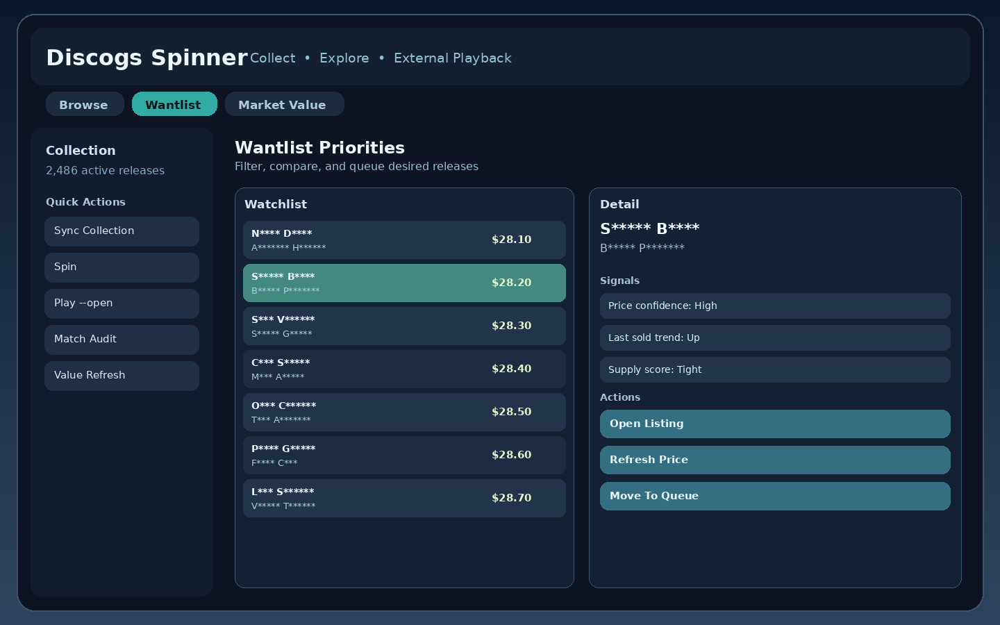
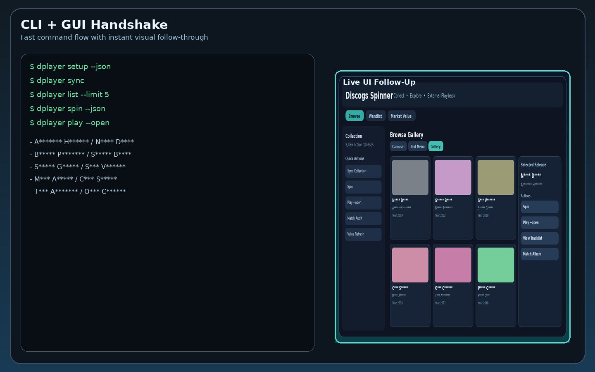

# Discogs Spinner

Discogs-first collection command center with a CLI core and optional desktop, API, and web layers.

> Playback note: Discogs Spinner does **not** stream audio inside its own UI. It opens or controls playback in external apps/services (for example Spotify).

<p align="center">
  <a href="https://github.com/edonahue/Discogs_Spinner/actions/workflows/core_plus_ci.yml"></a>
  <a href="https://github.com/edonahue/Discogs_Spinner/actions/workflows/pilot_validation_windows_macos.yml"></a>
  <a href="https://github.com/edonahue/Discogs_Spinner/releases"></a>
  =3.10" src="https://img.shields.io/badge/python-3.10%2B-2f5d8a">
</p>

<p align="center">
  
</p>

## Product Screens

<p align="center">
  
  
</p>

<p align="center">
  
  
</p>

## Quick Start

```bash
python3 -m venv .venv
source .venv/bin/activate
pip install -r requirements.txt
pip install -e .

export DISCOGS_TOKEN="your_discogs_personal_token"

dplayer setup
dplayer sync
dplayer spin --json
dplayer play --open --json
```

Optional Spotify addon:

```bash
pip install -e ".[spotify]"
dplayer auth spotify-doctor --json
```

## Docs

Setup guides:

- [Windows Quickstart](docs/quickstart_windows.md)
- [Debian Quickstart](docs/quickstart_debian.md)
- [macOS Quickstart](docs/quickstart_macos.md)

Technical references:

- [Web App README](webapp/README.md)
- [Desktop Shell README](desktop_shell/README.md)
- [Cross-Platform Implementation Roadmap](docs/CROSS_PLATFORM_IMPLEMENTATION_ROADMAP.md)
- [Architecture ADRs](docs/adr/001-layered-architecture.md)

Product goals and current direction:

- [Product State](PRODUCT_STATE.md)
- [Stabilization Backlog (2026 Q1)](STABILIZATION_BACKLOG_2026Q1.md)
- [Stabilization Execution Tracker](docs/STABILIZATION_EXECUTION_2026Q1.md)
- [Status Checkpoint (2026-02-26)](docs/STATUS_CHECKPOINT_2026-02-26.md)

Project history snapshots:

- [Project Snapshot](PROJECT_SNAPSHOT.md)
- [Project Assessment](PROJECT_ASSESSMENT.md)
- [Documentation Summary](DOCUMENTATION_SUMMARY.md)
- [Strategic Expansion Notes (2026-02-26)](docs/STRATEGIC_EXPANSION_NOTES_2026-02-26.md)

Release and validation:

- [Testing Performed (2026-02-26)](docs/TESTING_PERFORMED_2026-02-26.md)
- [Release Checklist Status (`v0.2.0-rc4`)](docs/RELEASE_CHECKLIST_STATUS_v0.2.0-rc4_2026-02-26.md)
- [RC Release Runbook](docs/RC_RELEASE_RUNBOOK.md)
- [Release Notes Template](docs/RELEASE_NOTES_TEMPLATE.md)

## Contributing and Legal

- [Contributing](CONTRIBUTING.md)
- [LICENSE](LICENSE)
- [PRIVACY.md](PRIVACY.md)
- [TERMS.md](TERMS.md)
- [TRADEMARKS.md](TRADEMARKS.md)
- [COMPLIANCE.md](COMPLIANCE.md)

## Repository Naming

Public repository name is `Discogs_Spinner`.
Internal package and CLI identifiers remain `discogs_player` / `dplayer`.
